# Revue de code : on est pas venu-e-s pour souffrir !

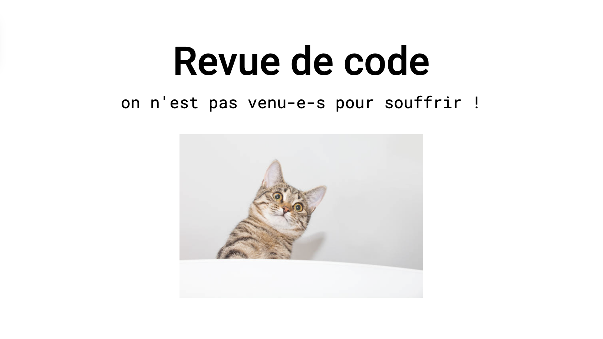

Est-ce que ça vous est déjà arrivé d'avoir été vexé par un commentaire laissé sur votre code ? 
Est-ce que vous avez passé plus de temps à y réfléchir qu'à corriger la typo ou le bug qu'on 
vous a relevé ? Bref, beaucoup de temps perdu pour pas grand chose. C'est ce dont je souhaite 
vous parler. 

## Qui je suis
Je m'appelle Anne-Laure, je suis développeuse back chez [Bedrock](https://bedrockstreaming.com/).
Je suis membre [Duchess](https://www.duchess-france.org/) (réseau 
de femmes qui travaillent dans l'IT), adhérente [AFUP](https://afup.org/home), membre de 
l'association [MiXiT](https://mixitconf.org/) qui 
organise 
une conférence à Lyon. J'aime le cinéma de genre, les fanzines et les bd. 

## Quelle revue de code? 

Quand on parle de revue de code, cela peut être plein de choses : revue de l'architecture de 
notre codebase, d'implémentation de solutions, etc. Je souhaite vous parler de la **revue du delta 
du code**, c'est à dire l'examen de la différence entre le code existant et le code proposé, par 
ses pairs. 

Cet examen peut être fait via différents outils tels que github.com, gitlab.com, Azure Devops, ou 
d'autres outils d'hébergement de code qui proposent cette fonctionnalité. 

Sur les différentes captures d'écran ci-dessus, vous verrez à chaque fois le même concept: la 
ligne ajoutée par la personne qui soumet le code est en vert, et en dessous se trouve le 
commentaire d'une personne qui réagit sur cette ligne en particulier. 

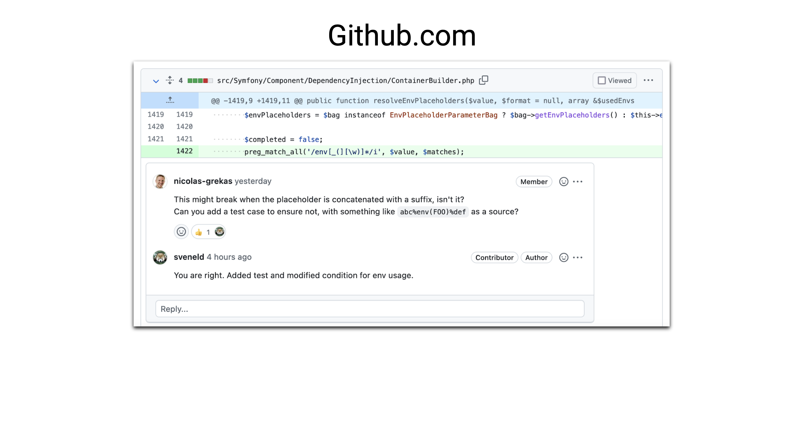
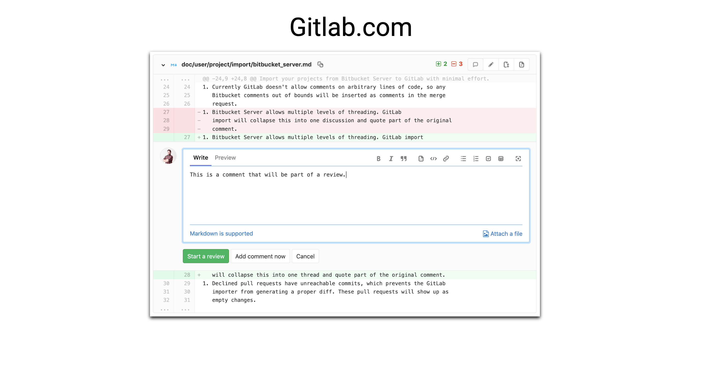

## L'anxiété de la revue de code

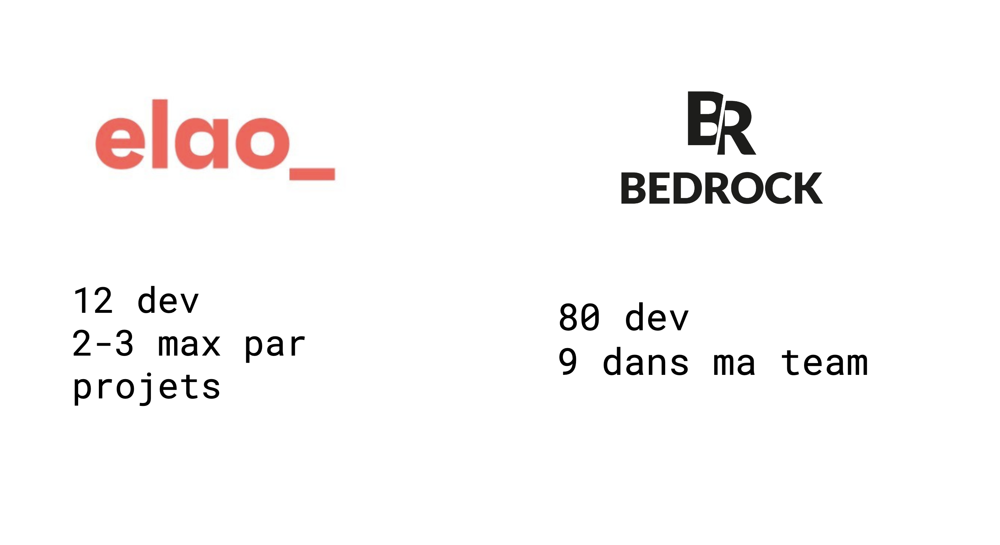

Il y a quelques mois, je travaillais chez Elao, une entreprise lyonnaise qui emploie environ 12 
développeurs/développeuses. Nous travaillons à 2 ou 3 personnes maximum par projet. Nous nous 
connaissions bien, les revues de code pouvaient se faire directement à l'oral. Quand je 
soumettais mon code en revue, j'étais très tranquille. (image de chat à gauche, accoudé contre 
un trottoir, dans une posture de détente maximale)

Quand j'ai souhaité changer d'entreprise et que j'ai rejoint Bedrock, une entreprise avec plus 
de 80 développeurs et développeuses rien qu'au back, et 10 personnes "juste" dans mon équipe, 
j'étais inquiète de savoir comment les revues de code se passeraient. Quels seraient ces yeux qui se 
poseraient sur mon code ? Seraient-ils bienveillants ? (image d'un groupe de chats à droite, 
inquiétants)

Sans compter que les reviews auraient lieu en anglais, ce qui peut entraîner d'autres risques de 
malentendus !

Spoil: tout s'est très bien passé, notamment car j'ai eu la bonne surprise de découvrir que ma 
nouvelle équipe utilise le standard des Conventional Comments, ce qui a énormément participé à ma 
bonne intégration dans l'équipe. 

## Pourquoi fait-on une revue de code ? 

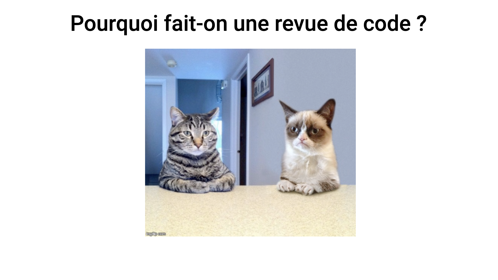
Revenons aux bases. Qu'est-ce qui nous pousse à faire une revue de code ? 

- Améliorer la qualité et la lisibilité du code grâce aux remarques de tous
- Appliquer les standards adoptés par l’équipe (et les apprendre !)
- Détecter et corriger les bugs
- Favoriser la collaboration en équipe
- Former les développeurs et développeuses au fur et à mesure des revues
- Partager les responsabilités : en approuvant une pull request ou une merge request, nous 
  sommes responsables en tant qu'équipe du code proposé !

## Tirer partie des outils!

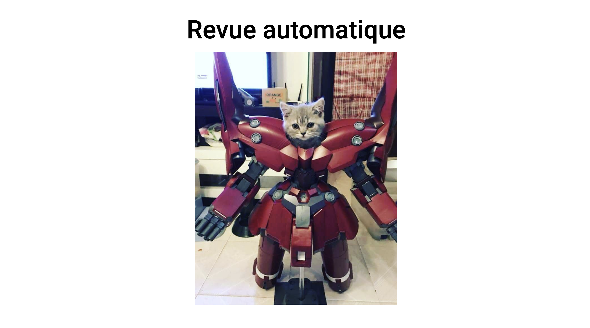

Inutile de charger nos collègues de faire ce dont un robot pourrait se charger : n'hésitez pas à 
tirer 
parti de l'automatisation (cs-fix, linting, détection de la présence d'un test ou non, etc.).

## Mais alors, on n'a aucune raison de souffrir ? 

On pose des questions, on s'aide mutuellement, on partage l'information entre nous, on apprend 
et on s'apprend des choses ... On aurait donc aucune raison de souffrir ? 

## Parfois, on manque d'empathie

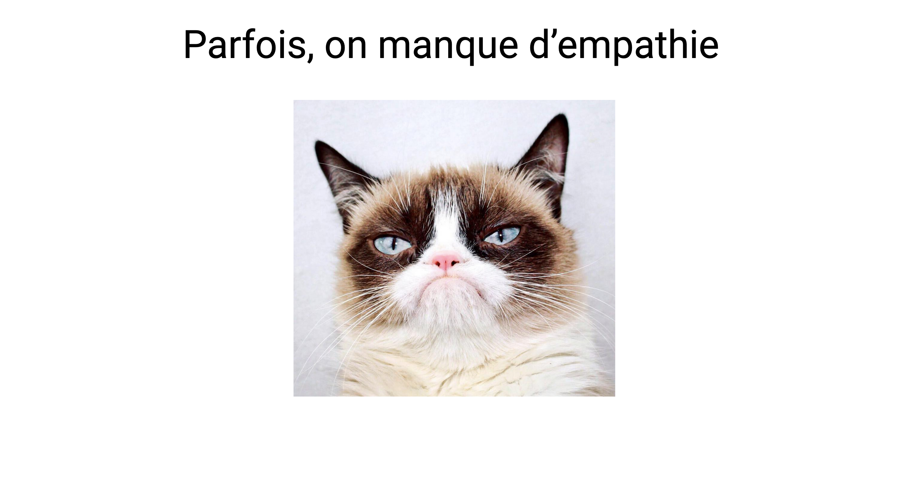

Mais parfois, on peut manquer d'empathie. On peut avoir l'impression d'être plus compétent(e) en 
critiquant les autres, on veut se rassurer en se montrant plus qualifié(e). On peut être habitué(e) à 
une culture de la compétition. 

... Et parfois, on souffre

Les commentaires peuvent être laborieux à lire ou à écrire, les maladresses et incompréhensions 
font perdre un temps précieux. **Des retours cruciaux peuvent être noyés** dans une longue liste de 
retours moins importants. 

## Comment peut-on faire mieux ?
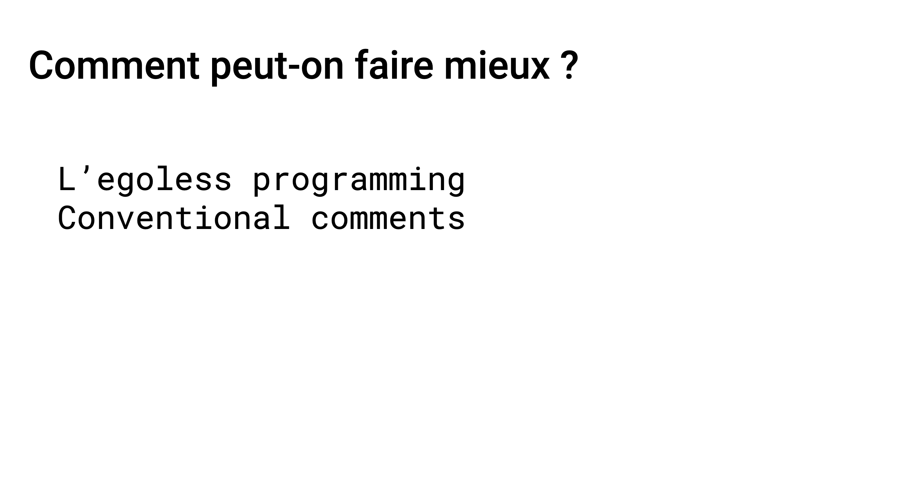

Avant de parler de la façon dont on peut formater ses commentaires, je pense qu'il est 
indispensable d'essayer **d'adopter auparavant une posture diminuant notre ego**. 

### L'egoless programming
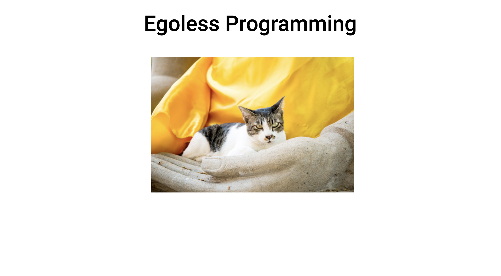

L'egoless programming est un style de programmation qui consiste à diminuer son ego, afin de 
**réduire les facteurs personels** lors des interactions avec ses pairs.
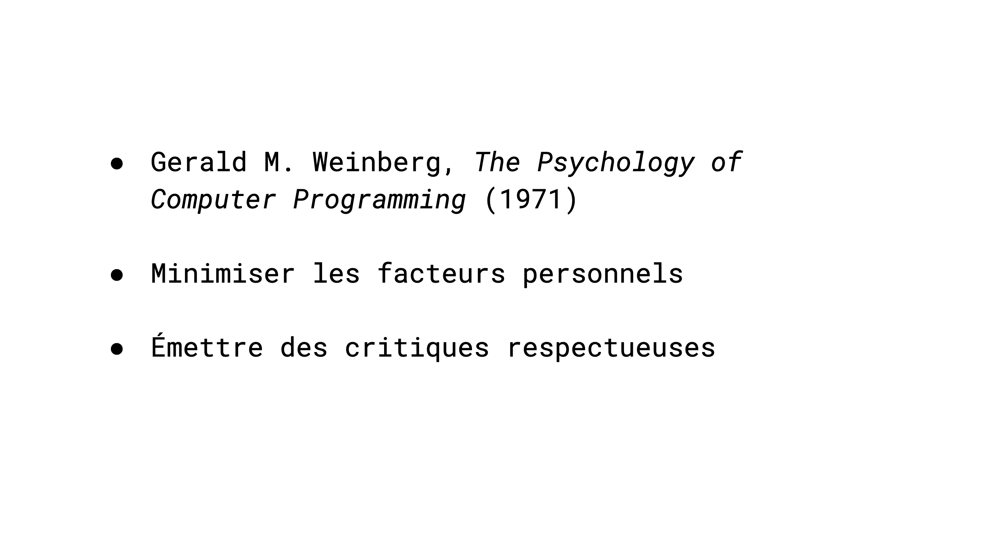

L'egoless programming a été proposé par Gerald M. Weinberg dans son livre The Psychology of 
Computeur programming (1971). Il propose de : 

- **Minimiser les facteurs personnels** afin d’améliorer la qualité globale du projet
- **Émettre des critiques de manière respectueuse** et collégiale dans laquelle les sentiments 
  personnels sont mis de côté

Il y a 10 commandements dans l'egoless, passons en revue certains d'entre eux qui pourront nous 
éclairer pour la suite !

#### "Understand and accept that you will make mistakes"

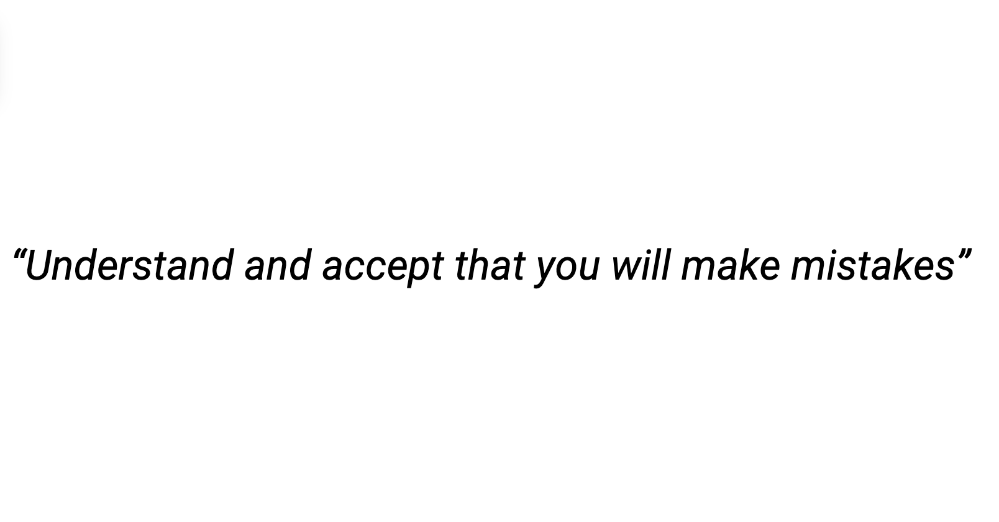

Comprenez et acceptez que vous allez faire des erreurs. On n’atteindra jamais la perfection, on 
fera des erreurs.
D'ailleurs, on apprend en faisant des erreurs. Accepter qu'on en fasse nous permet ensuite 
d'accepter que les autres en font également.

#### “You are not your code”

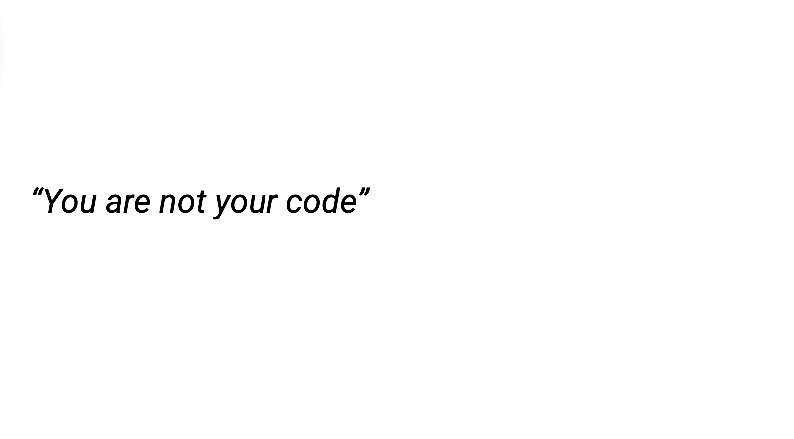

Vous  n’êtes pas votre code, vous n’êtes pas votre story. Vous écrivez du code qui ne vous appartient pas de toute manière.
**Le but est d’avoir un code qui est le meilleur possible et d'y trouver des problèmes pour 
l'améliorer,** il faut bien le prendre si on en trouve, c’est l’objectif!

#### “Fight for what you believe, but gracefully accept defeat”

**Combattez pour vos idées mais acceptez la défaite avec bienveillance**. L'egoless programming ne 
signifie pas ne pas avoir d'ego. 
Cherchons à défendre nos idées, mais si le groupe choisit une direction, on l’accepte même si 
ce n’est pas notre choix.

#### “Critique code instead of people – be kind to the coder, not to the code”

Ce commandement pourrait faire guise de conclusion : 
- Critiquez le code au lieu des personnes,
- Soyez factuels sur le code, 
- N’attaquez jamais les personnes.

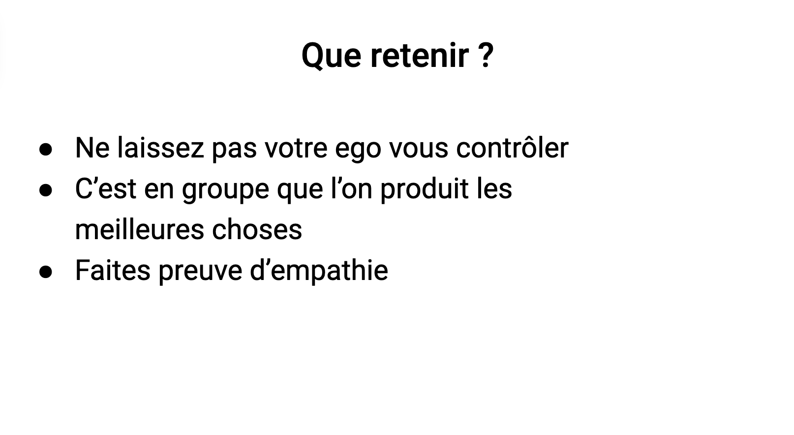

En résumé : Ne laissez pas votre ego vous contrôler, c’est en groupe qu’on produit le plus de 
valeur. Faites preuve d'empathie pour que tout le monde progresse!

#### Tous les commandements (en anglais)

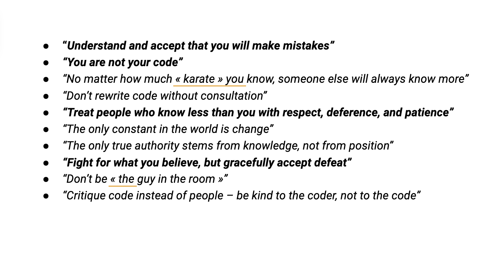

- “Understand and accept that you will make mistakes”
- “You are not your code”
- “No matter how much « karate » you know, someone else will always know more”
- “Don’t rewrite code without consultation”
- “Treat people who know less than you with respect, deference, and patience”
- “The only constant in the world is change”
- “The only true authority stems from knowledge, not from position”
- “Fight for what you believe, but gracefully accept defeat”
- “Don’t be « the guy in the room »”
- “Critique code instead of people – be kind to the coder, not to the code”

### Aller plus loin sur le sujet: plus de ressources

Une excellente conférence sur l'egoless programming qui prend le temps de revenir sur tous les 
concepts :
[Olivier Thelu, “Les 10 commandements de la programmation sans ego”](https://mixitconf.org/2022/les-10-commandements-de-la-programmation-sans-ego)

Une autre excellente conférence de Kim Laï Trinh, [“Auto-critique de la revue de code 
bienveillante”](https://afup.org/talks/3415-auto-critique-de-la-revue-de-code-bienveillante) qui 
parvient l'exercice difficile de se 
remettre en question sur la façon dont il fait des revues de code dans son équipe (il est lead).

## Formattez vos commentaires!

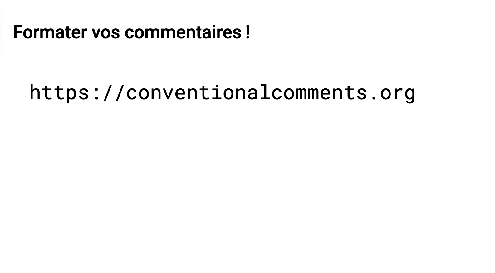

Une fois qu'on a une posture qui nous aide à mieux recevoir et donner des commentaires dans le 
cadre de nos revues de code, on peut réfléchir à la façon dont on les formate. Je vous propose 
d'examiner un standard qui permet :
- D'avoir une convention pour écrire des commentaires clairs et visuels
- De limiter les incompréhensions
- De réfléchir à l’intention avant d’écrire un commentaire 

[Voir le site du standard des conventions de commentaires, en anglais](https://conventionalcomments.org)

J'ai demandé à mon réseau si certaines personnes avaient déjà reçu des commentaires qui les ont 
vexées, touchées, bref, qu'ils ont mal reçus, sans me donner le contexte. Certains de ces 
commentaires étaient franchement malveillants, je les ai écartés. 

Voici une petite sélection : 

- "Poubelle"
- "OMG" (Oh My God)
- "Mal écrit"
- "Tu peux m'expliquer à quoi sert cette méthode ?"

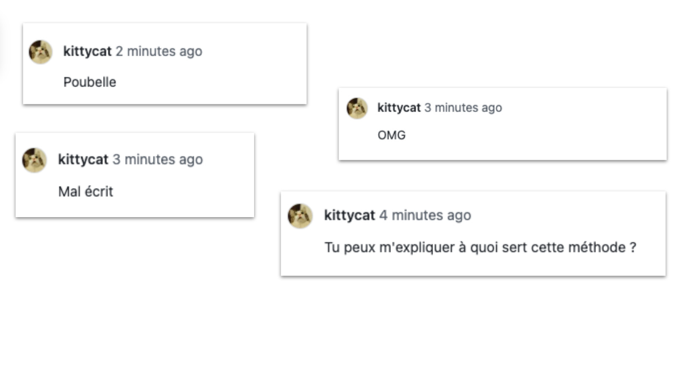

Pris de façon isolés, ces commentaires sont ambivalents, ils ne nous permettent pas de connaître 
le ton qu'a employé la personne. Essayons de chercher à améliorer la communication, avec un emoji. 

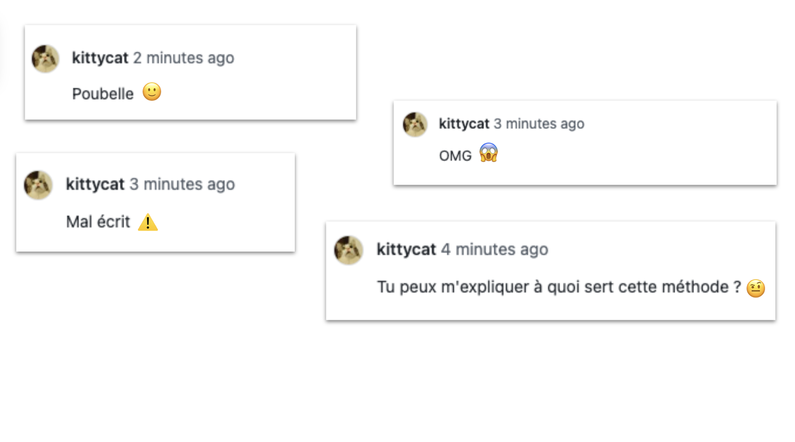

- "Poubelle 🙂"
- "OMG 😱" (Oh My God)
- "Mal écrit ⚠️"
- "Tu peux m'expliquer à quoi sert cette méthode ? 🤨"

Les émojis également peuvent prêter à confusion, ils n'amènent pas de clarification du propos 
dans ce cas-là. Certes, c'est un peu exagéré, mais c'est pour souligner le fait que le contexte 
est complètement manquant !

### Préfixer les commentaires

En préfixant le commentaire avec une catégorie, l’intention est clarifiée et le ton change 
radicalement.

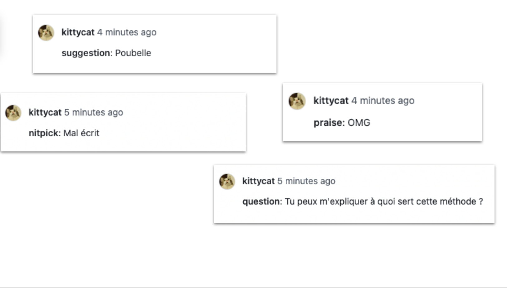

- "**suggestion:** Poubelle 🙂"
- "**paise:** OMG 😱" (Oh My God)
- "**nitpick:** Mal écrit ⚠️"
- "**question:** Tu peux m'expliquer à quoi sert cette méthode ? 🤨"

Vous l'aurez compris, je vous propose d'adopter un standard qui permet de formater les 
commentaires de façon à mieux communiquer, grâce à ce formattage:

<label> [decorations] <subject> 
[discussion] 

- **étiquette (label)** : “étiquette” pour signifier quel genre de commentaire il s’agit
- **sujet (subject)** : le commentaire en lui-même
- **contexte supplémentaire (decorations)** (optionnel)  : labels supplémentaires pour donner plus 
  d’indications (entre 
  parenthèses, séparés par des virgules).
Exemple : non-blocking, blocking, test …
discussion (optional) : contexte, raisonnement ou tout autre élément pour aider à comprendre le « pourquoi » et les « prochaines étapes » pour résoudre le commentaire

### Les labels

Voici la liste de labels extraits du standard : 

- praise
- nitpick
- suggestion
- issue
- todo
- question
- thought
- chore
- typo
- polish
- quibble

L'équipe est bien entendu libre de choisir ses labels. Voici quelques définitions (pour le reste,
se référer au site du standard).

#### Praise (éloge)
- Souligner quelque chose de positif.
- Pas de second degré
- Faire des éloges sincères.

#### Suggestion (suggestion)
- Améliorations au sujet actuel,
- Être explicite et clair,
- Expliquer pourquoi il s'agit d'une amélioration,
- Utiliser des patchs,
- Utiliser des decorations blocking ou non-blocking.

#### Issue (problème)
- Mettre en évidence des problèmes spécifique,
- Coupler ce commentaire avec une Suggestion. 

#### Thought (pensée)
- Idée qui a surgi lors de la relecture du code
- Pas bloquants par nature
- Extrêmement précieux, car possibilités de mentorat.

## Pourquoi on souffre moins ? 

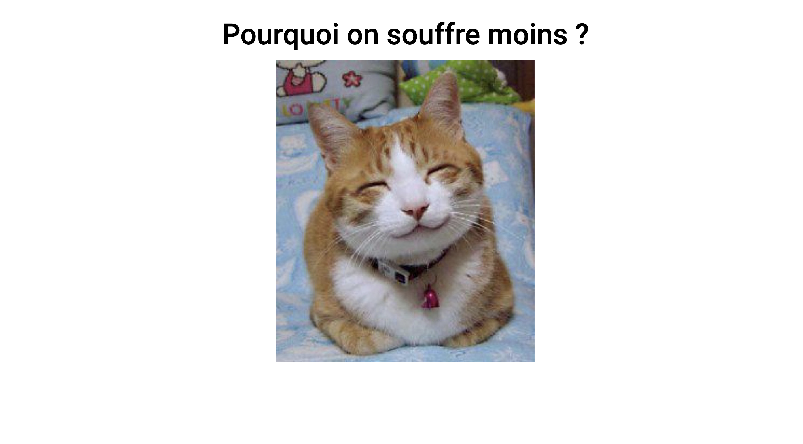

- La compréhension du commentaire est facilitée
- La catégorisation (étiquette) rend plus lisible le retour
- La contextualisation permet de savoir si on traite le retour immédiatement ou si on ouvre une 
nouvelle PR
- On limite les quiproquos ou les pertes de temps sur des commentaires non prioritaires
- On limite les mauvaises impressions sur le ton employé

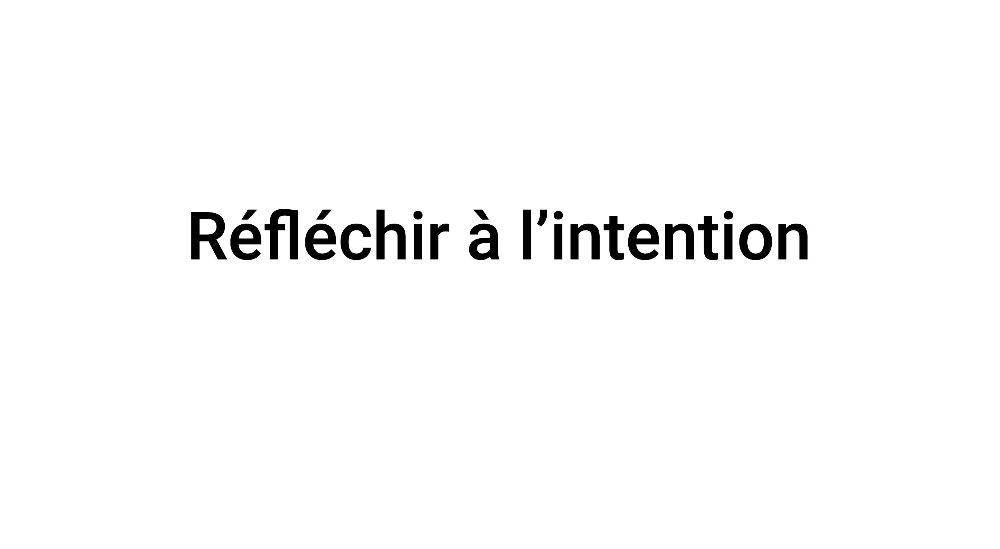

Et surtout ... On réfléchit à l’intention de son commentaire avant de l’écrire, et on 
s’auto-censure si ce n’est pas suffisamment factuel. 

### Quelques exemples 
En préfixant le commentaire avec une catégorie, l’intention est clarifiée et le ton change 
radicalement.
Notre fameux commentaire "Poubelle" pourrait être formaté comme ceci :

**nitpick (non-bloquant)** : Ici le résultat peut être directement retourné, sans passer par 
une variable intermédiaire. 
<patch de code pour décrire la solution proposée>

Ou encore le commentaire "Mal écrit" :
**nitpick** : Mal écrit.
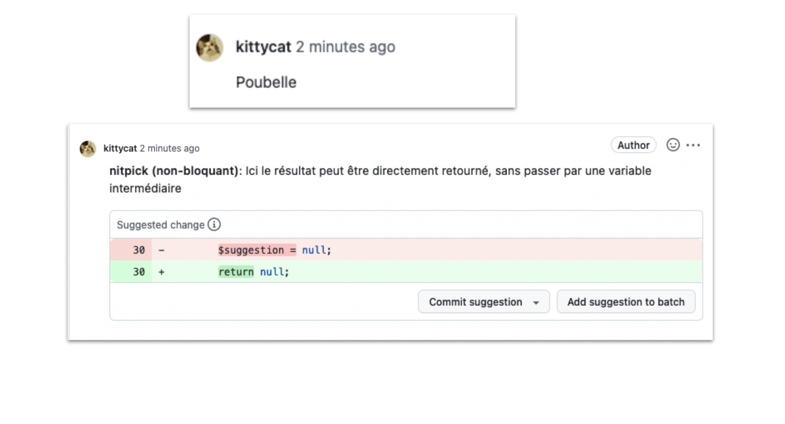

Proposition avec les conventional comments :

**nitpick (non-bloquant):** Typo dans le nom de la variable `$curentStuff` => `$currentStuff`

## C'est trop long !

Ok, l'idée vous plaît, mais la mise en place vous paraît trop douloureuse et longue ? 
Il y a différentes solutions pour vous faciliter la saisie des labels. 

1. Les templates de réponses sauvegardées sur github ([voir la documentation](https://github.com/settings/replies))
2. Des extensions Chrome ou Firefox

## Appropriez-vous la méthode!

Vous n'êtes pas obligé d'utiliser la méthode dans son intégralité, utilisez-la comme bon vous le 
semble et comme votre équipe en a envie. 

Dans son article [_“Conventional Comments : faire des revues de code avec le smile(y)”_](
https://www.24joursdeweb.fr/2021/conventional-comments-faire-des-revues-de-code-avec-le-smiley/
), Camille 
Regnault nous raconte la façon dont elle utilise cette méthode avec des emojis en guise de label,
afin de retranscrire l'urgence, la priorité, la teneur, etc. 

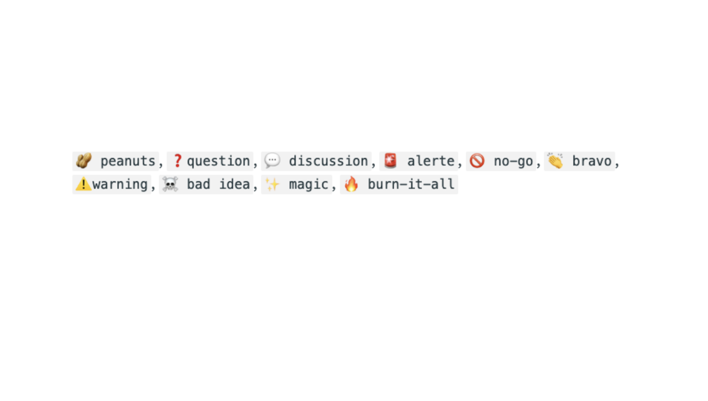

Quelques exemples : 
- 🥜 `peanuts`
- ❓ `question`
- 💬 `discussion`
- 🚨 `alerte`
- 🚫 `no-go`
- 👏 `bravo`
- ⚠️ `warning`
- ☠️ `bad-idea`
- ✨ `magic`
- 🔥 `burn-it-all`

## Quel impact sur l'onboarding ? 

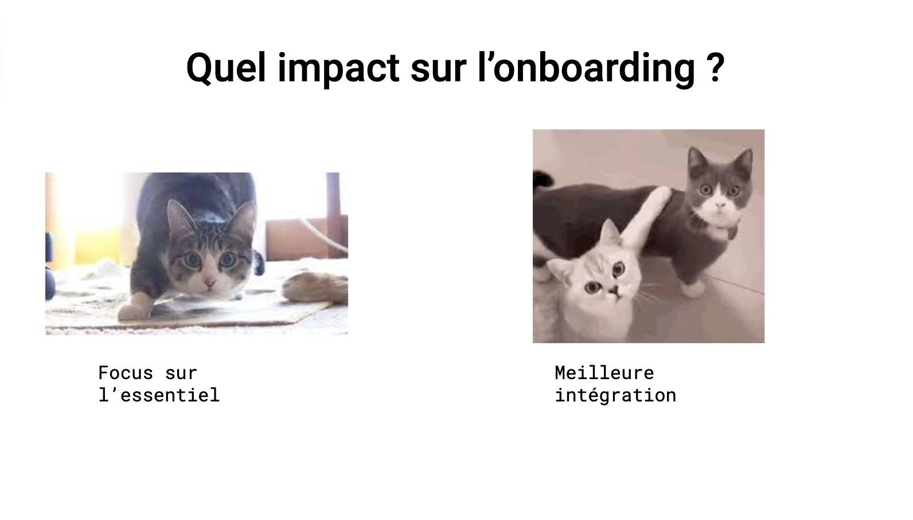

Globalement, j'ai trouvé que l'utilisation de ce standard dans ma nouvelle équipe m'a permis de 
mieux me concentrer sur l'essentiel, et d'être mieux intégrer.

- J’ai pu rapidement me rendre compte de ce qui était bloquant / non-bloquant,
- Je me suis focalisée sur les actions prioritaires à prendre,
- Je n’ai pas eu à me poser de questions sur le ton employé par mes collègues ni sur leur intention,
- j'ai pu rapidement faire des revues moi-même sans craindre d'être mal comprise,
- J’ai eu des retours qui m’ont permis de progresser sur la connaissance du fonctionnel et des 
  standards de la team.

## Autres bonnes pratiques d'onboarding

Bien entendu, il y a plein d'autres façons de bien accueillir les nouveaux développeurs ou 
nouvelle développeuses dans votre équipe !

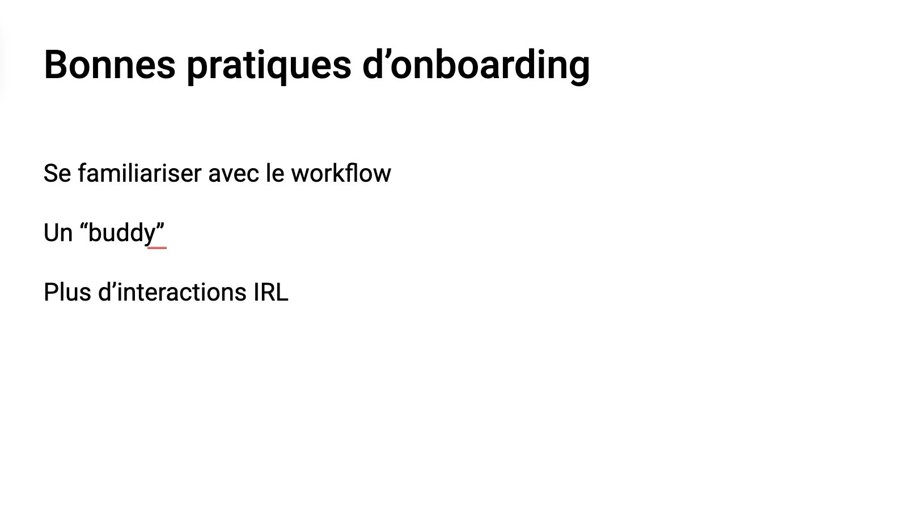

Quelques exemples :

- Se familiariser avec le workflow d'une publication de pull request ou merge request en faisant 
  une petite modification (ajouter son nom dans un fichier, par exemple?)
- Un “buddy” qui nous est assigné à l'arrivée dans l'entreprise avec qui on fait les premières 
  revues de code en direct
- Plus d’interactions en direct si les échanges sont trop longs par écrit

## Et si vraiment on souffre ? 

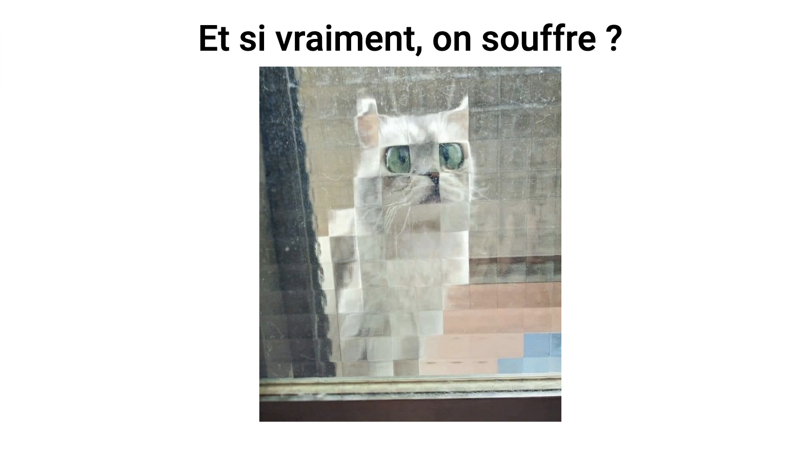

Si l'environnement de travail est difficile et que les échanges dans le cadre des revues de code 
se passe mal, il n'est pas forcément adapté de proposer d'utiliser ce standard. 

En effet, il me 
semble indispensable que l'équipe accepte d'adopter une posture proprice au travail en équipe 
avant de vouloir formater ses commentaires. 

# Merci de m'avoir écouté !

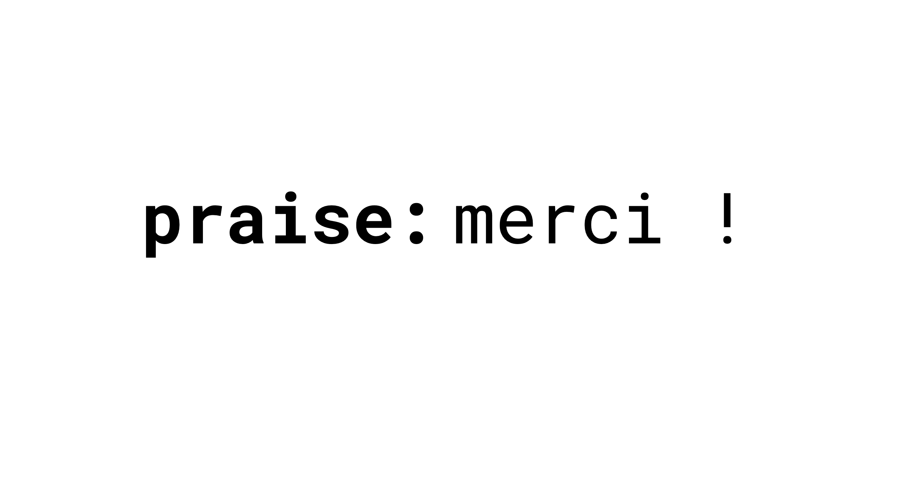

*praise*: merci !
